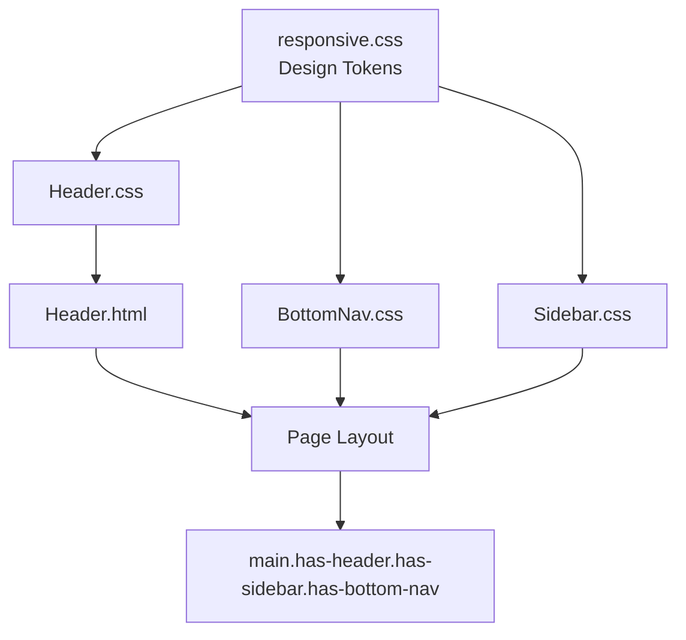

# Design Document: Frontend Header Responsive Styling

## Overview

This document describes the technical design for the `site-header` component — a responsive, accessible top-of-page navigation bar for the Stellar Raise crowdfunding dApp. The Header fills the navigation gap on mobile viewports (< 768px) where the Sidebar is hidden, and optionally serves as a persistent page-level context bar on all breakpoints.

The design follows the existing mobile-first, BEM-based component architecture established by `BottomNav` and `Sidebar`, reuses all design tokens from `responsive.css`, and is structured to integrate cleanly with the CI/CD pipeline.

### Goals

- Provide a fixed top navigation bar visible on all viewports
- Integrate with BottomNav (mobile) and Sidebar (tablet/desktop) without layout conflicts
- Meet WCAG 2.1 AA accessibility requirements
- Use only existing design system tokens
- Ship with automated touch-target tests and documented manual test cases

---

## Architecture

The Header is a standalone CSS + HTML component that slots into the existing frontend component library. It has no JavaScript runtime dependency — all responsive behavior is handled via CSS media queries and design tokens.



### Layout Coordination

The three navigation components share the viewport without overlap through CSS custom properties and layout offset classes:

```
Mobile (< 768px):
┌─────────────────────────────┐  ← site-header (fixed top, --header-height)
│         Header              │
├─────────────────────────────┤
│                             │
│    main.has-header          │  ← padding-top: var(--header-height)
│         .has-bottom-nav     │  ← padding-bottom: ~72px
│                             │
├─────────────────────────────┤
│       BottomNav             │  ← fixed bottom
└─────────────────────────────┘

Tablet/Desktop (≥ 768px):
┌──────────┬──────────────────┐
│          │     Header       │  ← fixed top, offset right of sidebar
│ Sidebar  ├──────────────────┤
│ (240px)  │                  │
│          │  main.has-header │
│          │     .has-sidebar │
└──────────┴──────────────────┘
```

---

## Components and Interfaces

### File Structure

```
frontend/components/header/
├── Header.html          # Component markup
├── Header.css           # Component styles
├── Header.test.html     # Manual browser test cases
└── header.test.js       # Automated touch-target test script
```

### Header.html

The `<header>` element uses BEM block class `site-header` and contains three child regions in a single flex row:

| Region | BEM Element | Content |
|--------|-------------|---------|
| Left | `site-header__logo` | Logo SVG + brand name |
| Center | `site-header__title` | Page title slot (optional) |
| Right | `site-header__actions` | Icon buttons, notification badge |

Key structural requirements:
- `role="banner"` on the `<header>` element
- `aria-label="Site header"` on the `<header>` element
- Skip-navigation link as the first focusable child: `<a href="#main-content" class="site-header__skip-link">`
- All decorative SVGs carry `aria-hidden="true"`
- Icon-only buttons carry descriptive `aria-label` attributes
- Notification badge carries `aria-label="N new notifications"`

### Header.css

The stylesheet is organized in the following sections (matching the pattern in `BottomNav.css` and `Sidebar.css`):

1. Block: `.site-header` — fixed positioning, z-index, background, border, safe-area padding
2. Elements: `__skip-link`, `__logo`, `__brand`, `__title`, `__actions`, `__icon-btn`, `__badge`
3. Modifier: `__icon-btn--active`
4. Responsive overrides: `@media (min-width: 768px)` and `@media (min-width: 1024px)`
5. Layout offset: `.has-header` applied to `<main>`
6. Reduced motion: `@media (prefers-reduced-motion: reduce)`

### CSS Custom Property: `--header-height`

Defined on `.site-header` and consumed by `.has-header`:

```css
.site-header {
  --header-height: 56px;
}

@media (min-width: 768px) {
  .site-header {
    --header-height: 64px;
  }
}

.has-header {
  padding-top: var(--header-height);
}
```

This allows other components (e.g., sticky sub-headers, scroll-offset anchors) to reference `--header-height` without hardcoding values.

### header.test.js

A vanilla JS script (no framework dependency) that:
1. Queries all interactive elements within `.site-header`
2. Measures their `getBoundingClientRect()` dimensions
3. Asserts `width >= 44` and `height >= 44`
4. Logs pass/fail results to the console with element references

This mirrors the pattern documented in `frontend/docs/TESTING_GUIDE.md`.

---

## Data Models

The Header is a pure presentational component with no runtime data model. Its configurable slots are expressed as HTML attributes and content:

| Slot | Mechanism | Example |
|------|-----------|---------|
| Brand name | Text content of `.site-header__brand` | `"Stellar Raise"` |
| Page title | Text content of `.site-header__title` | `"Dashboard"` |
| Action buttons | Child elements of `.site-header__actions` | Icon buttons |
| Notification count | `aria-label` + text of `.site-header__badge` | `"3"` |
| Active state | Modifier class on icon button | `site-header__icon-btn--active` |

### Design Token Dependencies

All values consumed from `responsive.css`:

| Token | Usage |
|-------|-------|
| `--color-neutral-100` | Header background |
| `--color-neutral-300` | Bottom border |
| `--color-neutral-700` | Default icon/text color |
| `--color-deep-navy` | Brand name text |
| `--color-primary-blue` | Active state, focus ring |
| `--color-error-red` | Notification badge background |
| `--space-2`, `--space-3`, `--space-4` | Padding and gaps |
| `--font-size-sm`, `--font-size-lg` | Label and brand typography |
| `--font-size-xs` | Badge typography |
| `--z-fixed` | Z-index layering |
| `--transition-fast` | Hover/focus transitions |
| `--radius-md`, `--radius-full` | Border radii |
| `--touch-target-min` | 44px minimum interactive size |
| `--safe-area-inset-top/left/right` | Notch/cutout padding |

No new global tokens are required. If a local value is needed (e.g., `--header-height`), it is scoped to the `.site-header` block.

---

## Correctness Properties

*A property is a characteristic or behavior that should hold true across all valid executions of a system — essentially, a formal statement about what the system should do. Properties serve as the bridge between human-readable specifications and machine-verifiable correctness guarantees.*

### Property 1: Touch target minimum size

*For any* interactive element rendered inside `.site-header` (links, buttons, icon buttons), its rendered bounding rectangle SHALL have both width and height greater than or equal to 44px.

**Validates: Requirements 4.1, 4.2**

---

### Property 2: Touch target spacing

*For any* two adjacent interactive elements inside `.site-header`, the gap between their bounding rectangles SHALL be at least 8px.

**Validates: Requirements 4.3**

---

### Property 3: Design token exclusivity

*For any* CSS declaration in `Header.css`, color values SHALL reference `var(--color-*)` tokens, spacing values SHALL reference `var(--space-*)` tokens, font-size values SHALL reference `var(--font-size-*)` tokens, and transition values SHALL reference `var(--transition-fast)` or `var(--transition-base)` — with no hardcoded hex, rgb, hsl, pixel, or rem literals outside of safe-area `calc()` expressions.

**Validates: Requirements 7.1, 7.2, 7.3, 7.4**

---

### Property 4: Safe-area padding correctness

*For any* value of `env(safe-area-inset-top)` (including zero), the Header's computed `padding-top` SHALL equal `var(--space-2)` plus the inset value. Similarly, computed `padding-left` SHALL equal `var(--space-4)` plus `env(safe-area-inset-left)`, and `padding-right` SHALL equal `var(--space-4)` plus `env(safe-area-inset-right)`.

**Validates: Requirements 3.1, 3.2, 3.3**

---

### Property 5: Layout offset correctness

*For any* viewport width and any page where `.has-header` is applied to `<main>`, the main element's computed `padding-top` SHALL equal the Header's `--header-height` value, and on mobile viewports the main element's `padding-bottom` SHALL account for the BottomNav height, ensuring no content is obscured by either fixed navigation bar.

**Validates: Requirements 9.1, 9.4**

---

### Property 6: Reduced motion suppression

*For any* user agent where `prefers-reduced-motion: reduce` is active, all CSS `transition-duration` and `animation-duration` values within the Header SHALL resolve to 0.01ms or less.

**Validates: Requirements 6.1, 6.2**

---

### Property 7: Notification badge accessibility label

*For any* notification count N rendered in a `.site-header__badge` element, the badge's `aria-label` attribute SHALL contain the string representation of N and the word "notifications".

**Validates: Requirements 5.5**

---

### Property 8: Header visibility and positioning across breakpoints

*For any* viewport width less than 768px, the Header SHALL have `position: fixed`, `top: 0`, and `display` not equal to `none`. *For any* viewport width of 768px or greater, the Header SHALL remain visible and its left edge SHALL be offset by at least the Sidebar width (240px on tablet, 280px on desktop), preventing overlap.

**Validates: Requirements 2.1, 2.2, 9.2**

---

### Property 9: Focus indicator on interactive elements

*For any* interactive element inside `.site-header` that receives keyboard focus, the computed `outline` SHALL be `2px solid var(--color-primary-blue)` and `outline-offset` SHALL be `2px`.

**Validates: Requirements 5.2**

---

### Property 10: Decorative SVG aria-hidden

*For any* SVG element inside `.site-header` that is purely decorative (not conveying unique information), the element SHALL carry `aria-hidden="true"`.

**Validates: Requirements 5.3**

---

### Property 11: Icon-only button aria-label

*For any* button inside `.site-header` whose visible content consists solely of an SVG icon (no visible text), the button SHALL carry a non-empty `aria-label` attribute describing its action.

**Validates: Requirements 5.4**

---

### Property 12: No duplicate CSS selectors

*For any* two selector blocks in `Header.css`, the selector strings SHALL be distinct — no selector SHALL appear more than once in the stylesheet.

**Validates: Requirements 8.3**

---

## Error Handling

Since the Header is a static HTML/CSS component with no runtime logic, error handling focuses on graceful degradation:

| Scenario | Behavior |
|----------|----------|
| `env(safe-area-inset-top)` unsupported | `calc()` falls back to `var(--space-2)` via the `, 0` default in the env() call |
| Missing `--header-height` consumer | `.has-header` padding-top defaults to the token value; no layout break |
| Badge element absent | No badge rendered; no ARIA error since element is simply absent |
| Icon-only button missing `aria-label` | Caught by automated accessibility audit (axe/Lighthouse) in CI |
| Font load failure | System font stack fallback defined in `--font-family-primary` |
| CSS custom property not defined | Browser uses initial value; flagged by CSS linting in CI |

---

## Testing Strategy

### Dual Testing Approach

Both unit/example tests and property-based tests are required for comprehensive coverage.

**Unit / example tests** (`Header.test.html`) cover:
- Visual rendering at 375px, 768px, 1280px viewports
- Skip-link visibility and focus behavior
- Active state indicator rendering
- Badge display with and without count
- Sidebar co-existence at tablet/desktop breakpoints
- BottomNav co-existence at mobile breakpoint
- Reduced motion: verify transitions are suppressed
- Keyboard tab order through all interactive elements

**Automated script tests** (`header.test.js`) cover:
- Touch target size assertion for all interactive elements (Property 1)
- Touch target spacing assertion between adjacent elements (Property 2)

### Property-Based Testing

The property-based tests are implemented using **fast-check** (JavaScript), which generates random inputs to validate universal properties.

Each test runs a minimum of **100 iterations**.

Tag format: `Feature: frontend-header-responsive-styling, Property N: <property_text>`

| Property | Test Approach | fast-check Strategy |
|----------|---------------|---------------------|
| P1: Touch target size | Generate random viewport widths in [320, 1920]; render header; measure all interactive elements | `fc.integer({ min: 320, max: 1920 })` |
| P2: Touch target spacing | Generate random sets of adjacent button pairs; measure gaps | `fc.array(fc.record({...}))` |
| P3: Token exclusivity | Parse `Header.css` AST; for each declaration check value against allowed patterns | `fc.constantFrom(...cssDeclarations)` |
| P4: Safe-area padding | Generate random inset values including 0; verify computed padding = space token + inset | `fc.nat({ max: 60 })` mapped to env mock |
| P5: Layout offset | Generate random `--header-height` values; verify `.has-header` padding-top matches | `fc.integer({ min: 40, max: 120 })` |
| P6: Reduced motion | Toggle `prefers-reduced-motion`; verify all transition/animation durations ≤ 0.01ms | `fc.boolean()` for media query state |
| P7: Badge aria-label | Generate random notification counts [0, 999]; verify aria-label contains count + "notifications" | `fc.integer({ min: 0, max: 999 })` |
| P8: Visibility & positioning | Generate random viewport widths across mobile/tablet/desktop ranges; verify position and offset | `fc.integer({ min: 320, max: 1920 })` |
| P9: Focus indicator | Enumerate all interactive elements; programmatically focus each; verify computed outline | `fc.constantFrom(...interactiveElements)` |
| P10: SVG aria-hidden | Enumerate all SVG elements; verify aria-hidden="true" on decorative ones | `fc.constantFrom(...svgElements)` |
| P11: Icon-only button aria-label | Enumerate all icon-only buttons; verify non-empty aria-label | `fc.constantFrom(...iconButtons)` |
| P12: No duplicate selectors | Parse all selector strings from Header.css; verify uniqueness | `fc.constantFrom(...selectors)` |

### CI/CD Integration

The following checks run on every pull request:

1. **HTML validation** — W3C validator rules via `html-validate` CLI
2. **CSS linting** — `stylelint` with no-duplicate-selectors rule; no hardcoded color/spacing values
3. **Touch target script** — `node header.test.js` exits non-zero on any failing assertion
4. **Accessibility audit** — `axe-core` CLI or Lighthouse CI checks ARIA labels, focus indicators, contrast
5. **Visual regression** (optional) — Percy or BackstopJS snapshot at 375px, 768px, 1280px

### Accessibility Verification Checklist

- [ ] Skip link is the first focusable element and becomes visible on focus
- [ ] All interactive elements reachable via Tab in left-to-right order
- [ ] Focus indicator: `outline: 2px solid var(--color-primary-blue); outline-offset: 2px`
- [ ] All decorative SVGs have `aria-hidden="true"`
- [ ] All icon-only buttons have descriptive `aria-label`
- [ ] Notification badge `aria-label` includes count and context
- [ ] `role="banner"` present on `<header>`
- [ ] Color contrast ≥ 4.5:1 for all text
